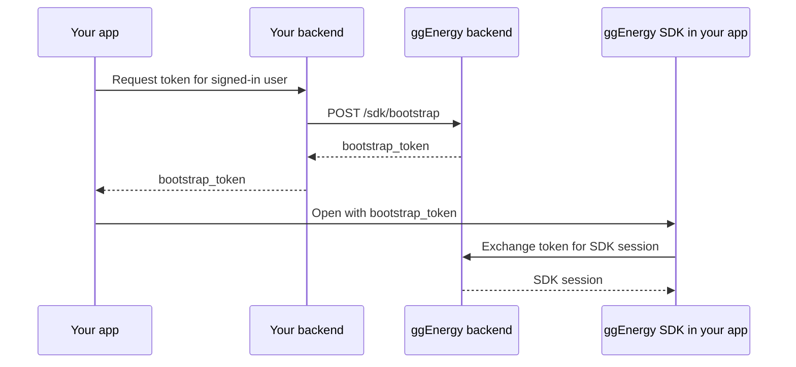

# Backend integration

The mobile app must not call ggEnergy's partner bootstrap API directly. Your
backend is the only component that receives and stores the credentials supplied
during onboarding.

## Flow

1. Your app authenticates a user with your existing sign-in flow.
2. The authenticated app asks **your backend** for a ggEnergy bootstrap token.
3. Your backend derives the user's stable external ID from its authenticated
   session, then calls ggEnergy with that ID and its server credentials.
4. ggEnergy validates the partner, finds or creates the linked user, and
   returns a one-time, short-lived bootstrap token.
5. Your backend returns the token to the app immediately.
6. The app opens the SDK with that token. The SDK performs its own session
   exchange and then makes all ggEnergy API calls itself.



## Onboarding contract

Email [info@goenergy.am](mailto:info@goenergy.am) before implementing this
flow. ggEnergy will provide:

- The bootstrap API base URL and access for your environment.
- Your server-side client credentials.
- The external-user identifier rules and allowed environments.
- Enabled payment providers and any platform-specific configuration.

Your backend calls `POST /sdk/bootstrap` at the supplied base URL. Authenticate
and authorize every request to your own token endpoint. Derive
`external_user_id` on your server; do not accept an arbitrary ID from the app.
Use the credentials supplied during onboarding:

```json
{
  "client_id": "<partner client ID>",
  "client_secret": "<partner client secret>",
  "external_user_id": "<your authenticated user ID>"
}
```

Keep `client_secret` in a server-side secret store. Never send it to the app or
log the bootstrap request body.

## Token response

ggEnergy returns the token directly in its response:

```json
{
  "bootstrap_token": "<one-time token>"
}
```

Your backend should pass the token to the mobile app only for the current SDK
launch. Your own app-facing response envelope may differ from ggEnergy's
response; pass the `bootstrap_token` string to the SDK.

Treat the token as a secret. Do not persist it, cache it for another launch,
send it to analytics, or write it to logs.

## Failure handling

- If your backend cannot obtain a token, keep the user in the host app and
  show a retryable error.
- If the SDK rejects or expires a token, request a new one from your backend
  and open the SDK again. Do not retry a token that was already used.
- Keep the partner credentials only in a server-side secret store with access
  limited to the service that performs the bootstrap request.
